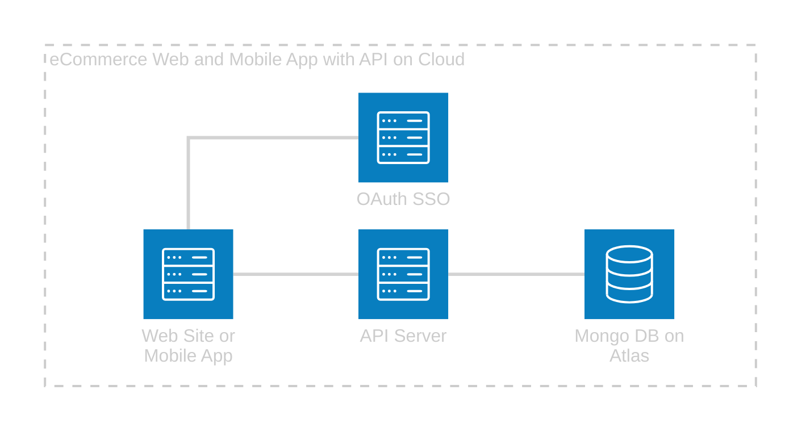

### Collab Ecommerce frontend Repository  
---  
`desktop-web`: contains our React desktop app  
`mobile-app`: contains our React Native mobile app  
`shared`: contains helper functions/methods/logic that can be shared between `desktop-web` & `mobile-app`  

### Architecture  
---  

